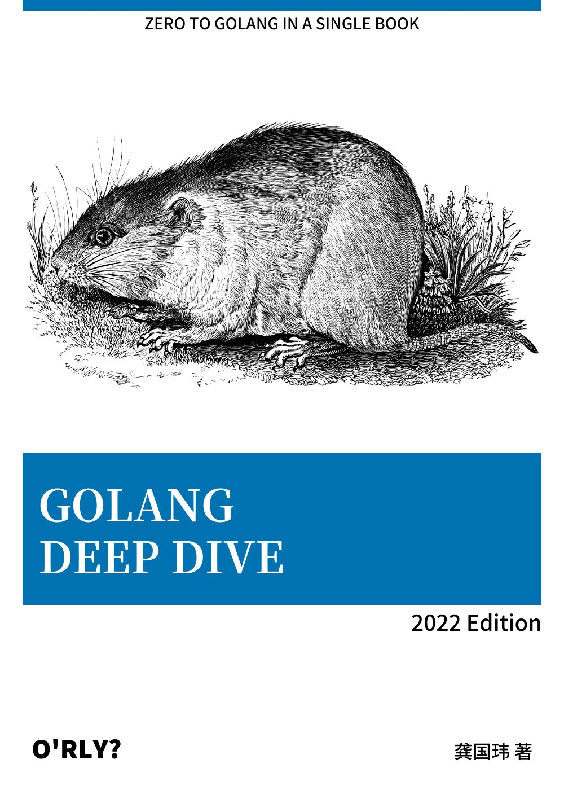

# GoDeepDive

## 内容简介
本书适合对 Go 感兴趣的入门新手、Go 技术开发人员阅读。

本书是一本专为开发者学习 Go 语言而写的电子书。目标是达到一种恰到好处的平衡，既能够很好地概述需要了解的知识，又没有对其他语言中易于理解的概念加以重复。全书章节待定。

## 关于封面
封面来源于开源项目 [nanmu42/orly](https://github.com/nanmu42/orly/blob/master/README_ZH.md) ，与 O'Reilly 没有任何关系。模仿 O'Reilly 动物书的封面是为了向他们致敬。

